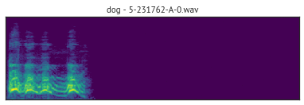

# Environmental Sound Classification with Deep Learning

Below, you will find the summary of my project. You can find the full details in my '*Report on Deep Learning for Environmental Sound Classification.pdf*'. I achieved a high first class grade (84%), which was in the top 5% percent of a class of 157 students. 

## Overview

>
>
This project explores the classification of environmental sounds using advanced deep learning techniques. The study utilizes the [ESC-50 dataset](https://github.com/karoldvl/ESC-50) dataset to compare the efficacy of Mel spectrograms and raw audio waveforms in model training.

>
>
## Key Findings
- **Data Augmentation Impact**: Data augmentation significantly improves model accuracy and robustness. Techniques like pitch shifting, time stretching, and noise addition were particularly effective.
- **Model Performance**: Different neural network architectures were compared, with convolutional neural networks (CNNs) optimized for Mel spectrogram inputs showing the best results. The study highlights the role of advanced architectures in achieving higher classification accuracy.
- **Challenges Addressed**: The project tackles common issues in sound classification such as class imbalance and feature extraction nuances, offering solutions that enhance classification accuracy.

## Technologies Used
- **Python** for all preprocessing and model training.
- **Librosa** library for [audio signal processing](https://librosa.org/doc/latest/index.html), and synthetic data generation for data augmentation.
- **Keras** and **TensorFlow** for building and training deep learning models.

## Models Explored
- CNN architectures tailored for both Mel spectrograms and raw audio waveforms.
- AclNet SC model noted for its robust performance on raw waveform input.

## Conclusions
The study confirms the potential of deep learning in accurately classifying environmental sounds, contributing valuable insights into sound classification systems and suggesting directions for future research in audio analysis.

## Some Technical Issues during the Project
1. The initial preprocessing approach used matplotlib for image generation which was abandoned due to several issues, resolution loss, introduction of irrelevant color channels, and high computation times. A revised methodology using Librosa was implemented, improving data quality and processing speed from several hours to a few minutes.
2. Initial training results showed implausibly high accuracies (higher than papers that used models with attention mechanism or foundational models with transfer learning) due to an error in data splitting, as the augmented data overlapped with the testing set. This issue was resolved by using a fixed random state in the train-test split, for both the augmented as well as the original data which meant that they were split in the same manner and did not overlap. This lead to more realistic and improved model performance.

## How to Use This Repository
- Clone the repository to get started.
- Install the required Python packages using `pip install -r requirements.txt`.
- Explore the notebooks to see the data augmentation processes and model training steps.

## Future Work
Further exploration into unsupervised learning models and real-time classification systems could expand the capabilities and applications of environmental sound classification. Adittionally, it would be interesting to use GANs to generate environmental sounds and then in turn use the generated sounds to retrain CNN models.
